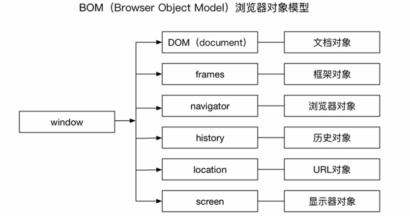

# BOM

## 一、引言

浏览器对象模型（Browser Object Model，BOM）是在 Web 中使用 JavaScript 的核心，该对象提供了与浏览器交互相关的对象结构。BOM 由多个子对象组成，其核心为 window 对象，它是 BOM 的顶层对象，表示在浏览器环境中的一个全局的顶级对象，所有在浏览器环境中使用的对象都是 window 对象的子对象。BOM 的组成结构如下图所示：



## 二、window 对象

BOM 的核心对象是 window，它表示浏览器的一个实例。在浏览器中，window 对象既是 JavaScript 访问浏览器窗口的一个接口（提供了处理浏览器窗口的方法和属性），同时也是ECMAScript 规定的 Global 对象。

### 1. 全局作用域

window 对象是浏览器对象中的默认对象，所以可以**隐式地引用** window 对象的属性和方法。在浏览器环境中，添加到 window 对象中的方法、属性等，其作用域都是全局的。并且在全局作用域中声明的变量或函数都会变成 window 对象的属性和方法。此外， JavaScript 中的标准内置对象（Gobal、Math），在浏览器环境中也是做为 window 对象的方法和属性出现的。

虽然在全局作用域中声明的变量会成为 window 对象的属性，但是定义全局变量和在 window 对象上直接定义属性还是有区别的：**全局变量不能通过 delete 操作符删除，而直接在 window 对象上定义的属性可以**。

```javascript
var age = 20;
window.name = 'John';

delete window.age; // 在IE < 9时抛出错误，在其他所有浏览器中返回false
delete window.name; // 在IE < 9时抛出错误，在其他所有浏览器中返回true

console.log(window.age); // 20
console.log(window.name); // undefined
```

### 2. window 对象方法

window 对象上的常见方法有如下：

| 方法              | 说明                      |
| --------------- | ----------------------- |
| alert()         | 显示带有一段消息和一个确认按钮的警告框     |
| prompt()        | 显示可提示用户输入的对话框           |
| confirm()       | 显示带有一段消息以及确认按钮和取消按钮的对话框 |
| open()          | 打开一个新的浏览器窗口或查找一个已命名的窗口  |
| close()         | 关闭浏览器窗口                 |
| print()         | 打印当前窗口的内容               |
| focus()         | 把键盘焦点给予一个窗口             |
| blur()          | 把键盘焦点从顶层窗口移开            |
| moveBy()        | 把窗口移动相应像素距离的位置          |
| moveTo()        | 把窗口移动到指定的位置             |
| resizeBy()      | 把窗口在水平和垂直方向上调整相应像素数     |
| resizeTo()      | 把窗口调整到指定大小              |
| scrollBy()      | 按照指定的像素值来滚动内容           |
| scrollTo()      | 被内容滚到到指定的坐标             |
| setInterval()   | 每隔指定的时间来执行代码            |
| clearInterval() | 取消 setInterval() 的设置    |
| setTimeout()    | 在指定的延迟时间后来执行代码          |
| clearTimeout()  | 取消 setTimeout() 的设置     |

### 3. 窗口位置

window 对象中提供了获取窗口位置的属性：

* `screenLeft` 和 `screenTop` 分别表示窗口相对于左边和上边的值，这两个属性在 Chrome、Safari、IE、Opera 中存在；
* `screenX` 和 `screenY` 分别表示窗口相对于左边和上边的值，这两个属性在 Firefox 浏览器中存在；

这几个属性在不同浏览器所表示的含义也不尽相同：

* 在 IE、Opera 中，表示是从屏幕左边和上边到由 window 对象表示的页面可见区域的距离；
* 在 Chrome、Firefox、Safari 中，表示整个浏览器窗口相对于屏幕的坐标值；

window 对象也提供了改变窗口位置的方法：

* `window.moveTo(x, y)`：将窗口移动到 x 和 y 代表的坐标处；
* `window.moveBy(x, y)`：将窗口分别在水平和垂直方向上移动相应像素数；

> 需要注意的是，这两个方法可能会被浏览器禁用。另外，这两个方法都不适用于框架，只能在最外层的window对象使用。

### 4. 窗口大小

window 对象中提供了获取窗口大小的属性：

* `innerWidth` 和 `innerHeight`
* `outerWidth` 和 `outerHeight`

这几个属性在不同浏览器所表示的含义也不尽相同：

* 在 IE、Safari、Firefox 中，`outerWidth` 和 `outerHeight` 表示浏览器窗口本身的尺寸，`innerWidth` 和 `innerHeight`表示页面视口的尺寸；
* 在 Opera 中，`outerWidth` 和 `outerHeight` 表示页面视图容器的尺寸，`innerWidth` 和 `innerHeight`表示该容器中页面视图区的大小（减去边框宽度）；
* 在 Chrome 中，`innerWidth` 、`innerHeight` 、`outerWidth` 和 `outerHeight` 返回相同的值，表示页面视口（viewport）大小而非浏览器窗口大小；
* 在移动浏览器中，`innerWidth` 和 `innerHeight` 表示可见视口的大小；

此外，在所有浏览器中，`document.documentElement.clientWidth` 和 `document.documentElement.clientHeight` 保存了页面视口的信息。在移动浏览器中，虽然也存在这两个属性，但是和桌面浏览器所表示的含义又大不一样，使用时应注意。

window 对象也提供了改变窗口大小的方法：

* `window.resizeTo(x, y)` ：将窗口调整到 x 和 y 表示的宽度和高度；
* `window.resizeBy(x, y)` ：将窗口分别在水平和垂直方向上调整相应像素数；

> 需要注意的是，这两个方法可能会被浏览器禁用。另外，这两个方法都不适用于框架，只能在最外层的window 对象使用。

### 5. 窗口开关

window 对象中提供了打开和关闭窗口的方法：

* `window.open()` ：接收四个参数，用于打开一个新窗口，返回指向新窗口的引用；
* `window.close()` ：关闭当前窗口或某个引用的窗口；

我们要注意的是，`window.open()`方法曾经被广告商滥用，严重影响用户体验，所以一些浏览器对该方法进行了一些限制，而用户通过浏览器设置或浏览器插件来屏蔽弹出窗口。

* 如果是浏览器内置的屏蔽程序阻止的弹出窗口，那么`window.open()`方法很可能会返回 `null` ；
* 如果是浏览器插件或其他程序阻止的弹出窗口，那么`window.open()`方法通常会抛出一个错误；

因此，在使用这个方法时，要想准确地检测出弹出的窗口是否被屏蔽，必须在检测返回值的同时，也需要将对`window.open()`方法的调用封装在一个 `try-catch` 块中。

## 三、document 对象

DOM 可以认为是 BOM 的一个子集，DOM 中文档操作相关对象，如 Node、Document、Element 等 DOM 节点类型对象，都是做为 window 对象的子属性出现的。

document 对象是 window 对象的一个属性，它是一个 Document 对象实例，表示当前窗口中文档对象，并且是唯一一个**既属于BOM 又属于 DOM 的对象**。通过该对象，可以对文档和文档中元素、节点等进行操作。可以通过 window.document 或直接使用 document 来引用该对象。

## 四、frames 对象

frames 对象是一个集合，表示当前页面中使用的子框架。如果页面中使用了框架，将产生一个框架集合 frames，在集合中可以用数字下标或名字索引框架。集合中的每一个对象，包含了框架的页面布局信息，以及每一个框架所对应的 window 对象。

### 1. 框架内 window 对象的访问

在上面示例中，可以在任意一个包含框架的页面中，使用 window.frames\[i] 或 window.frames\["name"] 来访问框架中的 window 对象，window.frames 属性在框架的每个页面中其数据相同。

在 window 对象中还有一个 `top` 属性指向最高（最外）层的框架的 window 对象，也就是浏览器窗口，top.frames\[i] 或 top.frames\["name"] 同样可以访问框架中的 window 对象。

因此对于一个包含框架的页面如下：

```html
<!DOCTYPE html>
<html>
<head>
  <title></title>
</head>
<frameset rows="300,*">
  <frame src="topFrame.html" name="topFrame" />
  <frameset cols="40%,60%">
    <frame src="leftFrame.html" name="leftFrame" />
    <frame src="http://itbilu.com" name="bottomFrameme" />
  </frameset>
</frameset>
</html>
```

可以使用以下几种方式去访问 topFrame 框架：

```javascript
window.frames[0];
window.frames["topFrame"];
top.frames[0];
top.frames["topFrame"];
frames[0];
frames["topFrame"];
```

### 2. parent 与 self 属性

top 属性始终指向最高（最外）层的框架的 window 对象，也就是浏览器窗口，而 `parent` 属性始终指向当前框架的直接上层框架的 window 对象。所以 top 不同于 parent。在某些情况下，parent 有可能等于 top；当页面不存在上级框架时，parent 一定等于 top。

为了加以区分，访问当前页面的 window 对象，可以使用 `self` 属性，这个属性始终指向当前页面的 window 对象。

top、parent、self 三个属性之间有相似之处，但三者是为不同目的而设计的。在使用时应该充分了解这几个属性的关系与作用，以便正确的访问指定的 window 对象。

## 五、navigator 对象

navigator 是指浏览器对象，该对象提供了当前正在使用的浏览器的信息，并且允许脚本查询并注册自己的一些活动信息。可以通过 window.navigator 或直接使用 navigator 来引用该对象。

### 1. 属性和方法

常用的 navigator 对象上的属性和方法有如下：

| 属性或方法                     | 说明                        |
| ------------------------- | ------------------------- |
| appCodeName               | 浏览器的名称，通常都是 Mozilla       |
| appName                   | 完整的浏览器名称                  |
| appVersion                | 浏览器的版本                    |
| buildID                   | 浏览器编译版本                   |
| cookieEnabled             | 表示    cookie 是否可用         |
| language                  | 浏览器的主语言                   |
| onLine                    | 表示浏览器是否连接到了因特网            |
| platform                  | 浏览器所在的系统平台                |
| plugins                   | 浏览器中安装的插件信息的数组            |
| systemLanguage            | 操作系统的语言                   |
| javaEnabled()             | 表示当前浏览器中是否启用了 Java        |
| preference()              | 设置用户的首选项                  |
| registerContentHandler()  | 针对特定的 MIME 类型将一个站点注册为处理程序 |
| registerProtocolHandler() | 针对特定的协议将一个站点注册为处理程序       |

### 2. 检测插件

检测浏览器中的插件可以通过 navigator 对象中的 plugins 属性来获取并检查。

对于非 IE 浏览器可以通过如下方法检测：

```javascript
// 在非 IE 浏览器中检测插件
function hasPlugin(name) {
    name = name.toLowerCase();
    for (var i = 0; i < navigator.plugins.length; i++) {
        if (navigator.plugins[i].name.toLowerCase().indexOf(name) > -1) {
            return true;
        }
    }
}

```

而在 IE 中检测插件的唯一方式就是使用专有的 ActiveXObject 类型，并尝试创建一个特定插件的实例：

```javascript
// 在 IE 浏览器中检测插件
function hasIEPlugin(name) {
    try {
        new ActiveXObject(name);
        return true;
    } catch (exception) {
        return false;
    }
}
```

鉴于检测这两种插件的方法差别太大，因此典型的做法是针对每个插件基于上面的两个通用方法分别创建自己的检测方法。先尝试使用不针对 IE 的插件检测方法，如果返回 false 则再使用针对 IE 的插件检测方法。例如检测浏览器中是否安装了 Flash 插件：

```javascript
// 检测所有浏览器中的 Flash
function hasFlash() {
    var result = hasPlugin('Flash');
    if (!result) {
        result = hasIEPlugin('ShockwaveFlash.ShockwaveFlash');
    }
    return result;
}
```

## 六、history 对象

history 对象来保存浏览器历史记录信息，也就是用户访问的页面。浏览器的前进与后退功能本质上就是 history 的操作。history 对象记录了用户浏览过的页面，通过该对象提供的API可以实现与浏览器前进/后退类似的导航功能。可以通过 window.history 或直接使用 history 来引用该对象。

### 1. 属性和方法

| 属性或方法          | 说明                                                                      |
| -------------- | ----------------------------------------------------------------------- |
| length         | 表示用户历史会话页面的数量，对于加载到窗口、标签页、或框架中的第一个页面而言，length 为0                        |
| state          | 查看  history 堆栈的顶部状态                                                     |
| back()         | 跳转到上一个会话页面                                                              |
| forward()      | 跳转到下一个会话页面                                                              |
| go()           | 跳转到指定会话页面，该方法接受一个整型或字符串类型的值。整型表示向前或向后跳转相应数的页面；字符串表示跳转到历史记录中包含该字符串的第一个页面 |
| pushState()    | 增加一条历史记录，并修改地址栏，不触发刷新                                                   |
| replaceState() | 替换当前历史记录，并修改地址栏，不触发刷新                                                   |

## 七、location 对象

location 是一个静态对象，该对象是对当前窗口 URL 地址的解析。该对象提供了可以访问 URL 中不同部分的信息属性，通过location 对象也可以实现页面或锚点跳转等功能。可以通过 window.location 或直接使用 location 来引用该对象。

### 1. 属性和方法

| 属性或方法     | 说明                                                               |
| --------- | ---------------------------------------------------------------- |
| hash      | 返回URL中的 hash（#后跟的字符），没有则返回空字符串                                   |
| host      | 返回服务器名称和端口号（如果有）                                                 |
| hostname  | 返回不带端口号的服务器名称                                                    |
| href      | 返回当前加载页面的完整URL                                                   |
| pathname  | 返回URL中的目录和文件名                                                    |
| port      | 返回URL中指定的端口号，没有则返回空字符串                                           |
| protocol  | 返回页面使用的协议，http: 或 https:                                         |
| search    | 返回URL中的查询字符串，以问号开头                                               |
| assign()  | 立即打开新的URL并在历史记录中生成一条记录                                           |
| replace() | 立即打开新的URL并覆盖当前的记录                                                |
| reload()  | 重新加载当前显示的页面，若传入 true 表示从服务器重新加载，若不传入参数则以最有效的方式重新加载，即会从浏览器缓存中重新加载 |

### 2. 获取URL参数

可以通过以下方法解析查询字符串，返回包含所有参数的一个对象：

```javascript
function getQueryStringArgs() {
    // 取得查询字符串并去掉开头的问号
    var qs = (location.search.length > 0 ? location.search.substring(1) : ''),
        args = {}, // 保存数据的对象
        items = qs.length ? qs.split('&') : [], // 取得每一项
        item = null,
        name = null,
        value = null;

    for (var i = 0; i < items.length; i++) {
        item = items[i].split('=');
        name = decodeURIComponent(item[0]);
        value = decodeURIComponent(item[1]);
        if (name.length) {
            args[name] = value;
        }
    }

    return args;
}
```

### 3. 位置操作

* 使用 location 对象可以通过很多方式来改变浏览器的位置；
* 最常用的就是`location.assign()`方法，打开指定URL并生成一条历史记录；
* **给 window.location 或 location.href 设置一个URL也会跳转，实际上是调用了assign()方法；**
* **修改 location 对象的 search、hostname、pathname、port 属性都会导致页面的跳转并生成一条记录；**
* **修改 location 对象的 hash 属性虽然也会生成一条记录，但是不会导致页面的重新加载；**

## 八、screen 对象

screen 对象中包含了用户显示器屏幕相关信息。screen 对象在 JavaScript 中并不太常用。通过该对象，可以访问用户显示器屏幕宽、高、色深等信息。并且每个浏览器中的 screen 对象都包含着各不相同的属性。可以通过 window.screen 或直接使用 screen 来引用该对象。

### 1. 属性和方法

| 属性                   | 说明                 |
| -------------------- | ------------------ |
| availHeight          | 屏幕的像素高度减系统部件高度     |
| availWidth           | 屏幕的像素宽度减系统部件宽度     |
| availLeft            | 未被系统部件占用的最左侧的像素值   |
| availTop             | 未被系统部件占用的最上方的像素值   |
| bufferDepth          | 读、写用于呈现屏外位图的位数     |
| colorDepth           | 用于表现颜色的位数；多数系统都是32 |
| deviceXDPI           | 屏幕实际的水平DPI         |
| deviceYDPI           | 屏幕实际的垂直DPI         |
| fontSmoothingEnabled | 表示是否启用了字体平滑        |
| height               | 屏幕的像素高度            |
| width                | 屏幕的像素宽度            |
| left                 | 当前屏幕距左边的像素距离       |
| top                  | 当前屏幕距上边的像素距离       |
| logicalXDPI          | 屏幕逻辑的水平DPI         |
| logicalYDPI          | 屏幕逻辑的垂直DPI         |
| pixelDepth           | 屏幕的位深              |
| updateInterval       | 读、写以毫秒表示的屏幕刷新时间间隔  |

## 九、参考

* 《JavaScript高级程序设计》第8章
* [https://itbilu.com/javascript/js/4k9JcnZRl.html#BOM-window](https://itbilu.com/javascript/js/4k9JcnZRl.html#BOM-window)
* [https://segmentfault.com/a/1190000000654274#articleHeader21](https://segmentfault.com/a/1190000000654274#articleHeader21)
