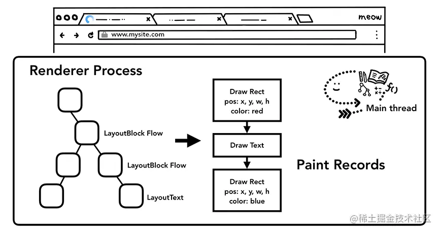

# 浏览器渲染流程

## 一、引言

我们把 HTML、CSS、JavaScript 等文件交给浏览器，经过浏览器内部的一些处理就可以显示出漂亮的页面，那在探究浏览器内部怎么处理之前，先回顾一下 HTML、CSS、JavaScript 是什么：

* **HTML**：HTML 的内容是 **由标签和文本组成**。每个标签都有它自己的语义，浏览器会根据标签的语义来正确展示 HTML 内容。
* **CSS**：**即层叠样式表，由选择器和属性组成**，如果需要改变 HTML 的字体颜色、大小等信息，就会用到 CSS。
* **JavaScript**：简称 JS，**通过 JS 可以修改页面内容**，让页面“动”起来。

这也是 **Web 标准的三大组成部分：结构、表现和行为**。

浏览器把 HTML、CSS、JS 渲染成页面是很复杂的一个过程，所以在渲染过程中会划分为多个子阶段，按照时间顺序可以划分为如下几个阶段：**构建 DOM 树**、**样式计算**（解析 CSS）、**获取布局树**、**生成图层树**、**图层绘制**、**栅格化处理**、**合成显示**。

下面将逐一介绍这些子阶段，每个阶段都有 **获取输入内容**、**处理内容**、**生成输出内容** 这样的周期存在，关注这些内容会更加清晰地了解每个子阶段。

## 二、渲染进程

渲染进程负责标签页内发生的所有事情。在渲染进程中，主线程处理服务器发送到用户的大部分代码。如果你使用 web worker 或 service worker，部分 JavaScript 将由工作线程处理。合成和光栅线程也在渲染进程内运行，以高效，流畅地呈现页面。

渲染进程的核心工作是将 HTML、CSS 和 JavaScript 转换为用户可以与之交互的网页。

## 三、构建 DOM 树

浏览器是没有办法直接理解和使用 HTML，所以需要将 HTML 转换为浏览器能够理解的结构——DOM 树。**DOM 把文档作为一个树形结构，树的每个结点表示了一个 HTML 标签或标签内的文本项**。

DOM 提供了对 HTML 文档结构化的表述。在渲染引擎中，DOM 有三个层面的作用：

* 从页面的视角来看，**DOM 是生成页面的基础数据结构**。
* 从 JavaScript 脚本视角来看，**DOM 提供给 JavaScript 脚本操作的接口**，通过这套接口，JavaScript 可以对 DOM 结构进行访问，从而改变文档的结构、样式和内容。
* 从安全视角来看，**DOM 是一道安全防护线**，一些不安全的内容会在 DOM 解析阶段被拒之门外。

> 简而言之，**DOM 是表述 HTML 的内部数据结构，它会将 Web 页面和 JavaScript 脚本连接起来，并过滤一些不安全的内容**。

构建 DOM 树的过程：

* **输入**：从网络请求或者缓存中拿到的 HTML 文件
* **处理**：通过 **HTML 解析器解析生成 DOM 树**，大概过程就是：拿到 HTML 文件的字节流数据，将这些字节数据 转化为字符串，然后将这些字符串转化为 **标记**（`token`），然后把这些标记进行 **词法分析** 转化为 `DOM` 节点，再将 `DOM` 节点 **构建为一棵 DOM 树**。
* **输出**：**输出一个树状结构的 DOM**，即 **DOM 树**。

DOM 和 HTML 内容几乎是一样的，但是和 HTML 不同的是，**DOM 是保存在内存中树状结构，可以通过 JavaScript 来查询或修改其内容**。

如下，我们可以通过打印 `document` 或在 `Elements` 查看 DOM，下面是一个简单的 DOM 树示例：

.png>)

## 四、样式计算

只拥有 DOM 不足以确定页面的外观，因为我们会在 CSS 中设置页面元素的样式。样式计算的目的是为了计算出 DOM 节点中每个元素的具体样式。主线程解析 CSS 并确定每个 DOM 节点计算后的样式。

即使你不提供任何 CSS，每个 DOM 节点都具有计算样式。这是因为浏览器具有默认样式表。

和 HTML 一样，渲染引擎也是无法直接理解 CSS 文件内容的，所以渲染引擎会先将其解析成 **浏览器可以理解的结构**，这个结构就是 **`styleSheets`**。

> 网上有很多地方是说把 CSS 文件转换为 CSSOM 树的，而在 [Chromium 源码（需要翻墙）](https://link.juejin.cn/?target=https%3A%2F%2Fchromium.googlesource.com%2Fchromium%2Fsrc) 上并没有 CSSOM 这个词，这个 `styleSheets` 是能够直观感受得到的。

我们可以通过 `document.styleSheets` 查看 `styleSheets` 结构：

样式计算的过程：

* **输入**：CSS 样式来源主要有三种：
  * 通过 `link` 引用的外部 CSS 文件
  * `<style>` 标签内的 CSS
  * 元素的 `style` 属性内嵌的 CSS
* **处理**：
  * **把 CSS 转换为浏览器能够理解的结构-- `styleSheets`**，`styleSheets` 具有两个作用：
    * 第一个是 **提供给 JavaScript 操作样式表的能力**；
    * 第二个是 **为布局树的合成提供基础的样式信息**。
  * **转换样式表中的属性值，使其标准化**；即需要把所有的值转换为渲染引擎容易理解的、标准化的计算值：
    * 例如：把 `2em` 转换为 `32px`、把 `blue` 转换为 `rgb(0, 0, 255)`、把 `font-weight: bold` 转换为 `font-weight: 700`
  * **计算出 DOM 树中每个节点的具体样式**，在这个过程中需要遵守 CSS 的继承规则和层叠规则：
    * CSS 继承就是每个 DOM 节点都包含有父节点的样式
    * 层叠是 CSS 的一个基本特征，它是一个定义了如何合并来自多个源的属性值的算法。
* **输出**：**每个 DOM 节点的样式，并被保存在 `ComputedStyle` 的结构**。

可以按 `F12` 打开开发者工具随便选择一个 `Elements` 元素，再选择 `Computed` 标签，如下图，右下角红色框内便是选中标签最终的 `ComputedStyle` 的值。

## 五、获取布局树

现在已经有了 DOM 树和 DOM 树中每个元素的样式，但还不能够渲染一个完整的页面，因为浏览器并不知道这些元素在页面上的几何位置。所以接下来就是**计算出 DOM 树中可见元素的几何位置，也就是布局（Layout）**。

布局阶段：

* **输入**：DOM 树和 CSSOM 树
* **处理**：
  * **构建一棵只包含可见元素的布局树**
    * 遍历 DOM 树中的所有可见节点，并把这些节点加到布局树中
    * 而不可见的节点会被布局树忽略掉，如属性包含 `dispaly:none` 的元素不会被包进布局树
  * **布局计算**：计算布局树节点的坐标位置，然后写回布局树中
* **输出**：包含 DOM 元素样式和位置的布局树

 (1).png>)

## 六、生成图层树

得到布局树之后要对其进行 **分层**，就好像搞定了它的 `x`、`y` 轴，之后是处理的是它的 `z` 轴，在 CSS 上比较能体现的就是 `z-index` `z` 轴排序属性、`position` 定位属性、`opacity` 透明属性等。通过分层可以实现一些复杂的效果，比如 3D 变换、页面滚动等，那么为了更加方便的实现这些效果，**渲染引擎会为特定的节点生成专用的图层，并且生成一棵对应的图层树**（`LayerTree`）。

当然**并不是布局树的每个节点都包含一个图层，如果一个节点没有对应的层，那么这个节点就从属于父节点的图层**。要满足以下两个条件中的一个，渲染引擎才会为特定的节点创建新的图层：

* 第一点，拥有 **层叠上下文属性** 的元素会被提升为单独的一层。即明确定位属性的元素、定义透明属性的元素、使用 CSS 滤镜的元素等拥有层叠上下文属性的元素
* 第二点，**需要裁剪的地方** 也会被创建为图层。
  * 需要裁剪即那些内容超出指定区域的，如一个 `div` 它的大小为 `200 * 200` 像素，当里面的文字内容过多超出 `200 * 200` 的面积时会裁剪，渲染引擎会为文字部分单独创建一个层，如果出现滚动条，滚动条也会被提升为单独的层。

这个图层分层的情况可以打开 Chrome 的开发者工具 **`Layers`** 查看，默认展示的工具中是没有的，它在右上角 `...` 更多中的 `More tools` 里面，它有一些如平移、旋转、复位的操作，见下图：

**生成图层树** 的过程：

* **输入**：布局树
* **处理**：将特定节点生成专用图层
  * 拥有 **层叠上下文属性** 的元素会被提升为单独的一层
  * **需要裁剪的地方** 会被创建为图层
* **输出**：图层树

## 七、绘制

在完成图层树的构建之后，渲染引擎会对图层树中的每个图层进行绘制，它会把一个图层的绘制拆分成很多小的绘制指令，然后再把这些指令按照顺序组成一个待绘制列表。

绘制列表中的指令其实非常简单，就是让其执行一个简单的绘制操作，比如绘制粉色矩形或者黑色的线等。而绘制一个元素通常需要好几条绘制指令，因为每个元素的背景、前景、边框都需要单独的指令去绘制。所以在图层绘制阶段，输出的内容就是这些待绘制列表。

如下图，打开 Chrome 的开发者工具中的 `Layers` 工具，选择 `document` 层，可以来实际体验下绘制列表，左边的区域是 `document` 的绘制列表，拖动右边区域中的进度条可以重现列表的绘制过程。

图层绘制的过程：

* **输入**：图层树
* **处理**：
  * 渲染引擎对图层树中每个图层进行绘制
  * 拆分成绘制指令，生成绘制列表，提交到合成线程
* **输出**：绘制列表

## 八、栅格化处理

**绘制列表**只是用来记录绘制顺序和绘制指令的列表，而实际上绘制操作是由渲染引擎中的**合成线程**来完成的。

当图层的绘制列表准备好之后，**主线程** 会把该绘制列表提交给 **合成线程**。通常一个页面可能很大，但是用户只能看到其中的一部分，我们把用户可以看到的这个部分叫做 **视口**（`viewport`）。在有些情况下，有的图层可以很大，比如有的页面你使用滚动条要滚动好久才能滚动到底部，但是通过视口，用户只能看到页面的很小一部分，所以在这种情况下，要绘制出所有图层内容的话，就会产生太大的开销，而且也没有必要。

基于这个原因，**合成线程会将图层划分为图块**（`tile`），这些图块的大小通常是 `256x256` 或者 `512x512`。

**合成线程会按照视口附近的图块来优先生成位图**，实际生成位图的操作是由栅格化来执行的。**所谓栅格化，是指将图块转换为位图**。而图块是栅格化执行的最小单位。渲染进程维护了一个栅格化的线程池，所有的图块栅格化都是在线程池内执行的。

.png>)

通常，栅格化过程都会使用 GPU 来加速生成，使用 GPU 生成位图的过程叫 **快速栅格化**，或者 GPU 栅格化，生成的位图被保存在 GPU 内存中。

**栅格化处理** 的过程：

* **输入**：绘制列表
* **处理**：
  * 根据视口，合成线程会将图层划分为 **图块**
  * 合成线程会按照视口附近的图块来优先生成 **位图**
* **输出**：保存在 GPU 内存中的位图

## 九、合成显示

* 一旦所有图块都被栅格化，**合成线程** 就会生成一个绘制图块的命令——`DrawQuad`，然后将该命令提交给 **浏览器进程**
* 浏览器进程里面有一个叫 `viz` 的组件，用来接收合成线程发过来的 `DrawQuad` 命令，然后将其页面内容绘制到内存中，最后再将内存显示在屏幕上。

这样到显示阶段，页面就加载显示完成了，这就是整个过程了。如下图：

## 十、重排和重绘

### **1. 重排**

**重排，也叫回流，是更新了元素的几何属性之后，浏览重新触发布局（Layout），更新完整的渲染流程的过程**。

它的关键 **在于修改了元素的几何属性**，例如改变元素的宽度、高度等，这个修改会让浏览器从布局开始更新整个渲染流水线，这个开销是最大的。如下图所示：

一些会引起重排操作的情况：

* 添加或者删除可见的 DOM 元素
* 元素的位置发生变化
* 元素的尺寸发生变化（包括外边距、内边框、边框大小、高度和宽度等）
* 内容发生变化，比如文本变化或图片被另一个不同尺寸的图片所替代。
* 浏览器的窗口尺寸变化（因为回流是根据视口的大小来计算元素的位置和大小的）

根据改变的范围和程度，渲染树中或大或小的部分需要重新计算，有些改变会触发整个页面的重排，比如，滚动条出现的时候或者修改了根节点。

### 2. 重绘

**重绘，因为没有引起几何位置的变化，所以浏览器会直接进入图层绘制阶段（Paint），然后执行之后的渲染流程**。

它的关键 **在于更新的是绘制属性，不会引起几何位置的变化**，例如修改了元素的背景颜色或者文字颜色，它会从图层绘制阶段开始更新渲染流水线，**相较于重排操作，重绘省去了布局和分层阶段**，所以执行效率会比重排操作要高一些。

所以说，**重排必定会发生重绘，重绘不一定会引发重排**。

### 3. 合成

从渲染流水线的角度看，修改布局属性会引起重排，修改绘制属性会引起重绘，那如果修改一个既不要布局也不要绘制的属性，渲染流水线又会怎么处理呢？

如果修改一个既不要布局也不要绘制的属性，渲染引擎将直接跳过布局和图层绘制的阶段，只执行后续的合成操作，这个过程叫做 **合成**。

比如使用了 CSS 的 `transform` 来实现动画效果，这可以避开重排和重绘阶段，直接在非主线程上执行合成动画操作。这样的效率是很高的，因为是在非主线程上合成，并没有占用主线程的资源，另外也避开了布局和绘制两个子阶段，所以 **相对于重绘和重排，合成能大大提升绘制效率**。

### 4. 浏览器的优化

现代的浏览器都是很聪明的，由于每次重排都会造成额外的计算消耗，因此大多数浏览器都会 **通过队列机制来批量更新布局**。浏览器会将修改操作放入到队列里，至少一个浏览器刷新（即`16.6ms`）才会清空队列。这样可以让多次的重排、重绘变成一次回流重绘。

但是，当在 **获取布局信息** 的时候，队列中可能有会影响这些属性或方法返回值的操作，即使没有，浏览器也会强制清空队列，**触发重排与重绘来确保返回正确的值**。

主要包括以下属性或方法：

* `offsetTop`、`offsetLeft`、`offsetWidth`、`offsetHeight`
* `scrollTop`、`scrollLeft`、`scrollWidth`、`scrollHeight`
* `clientTop`、`clientLeft`、`clientWidth`、`clientHeight`
* `width`、`height`
* `getComputedStyle()`
* `getBoundingClientRect()`

以上属性和方法都需要返回最新的布局信息，因此浏览器不得不清空队列，触发回流重绘来返回正确的值。因此，我们在修改样式的时候，最好避免使用上面列出的属性，他们都会强制刷新渲染队列。如果要使用它们，最好将值缓存起来。

### 5. 如何减少重排和重绘

在渲染流水线的视角下，**减少重排重绘，省去了布局和绘制阶段，这样少了渲染进程的主线程和非主线程的很多计算和操作，是能够加快页面的渲染展示的**，而我们的目的正在于此。浏览器本身会做一些优化，但是我们平时写代码也要注意避免重排和重绘：

在写 JS 代码时：

* **避免频繁操作样式**，最好一次性重写 `style` 属性，或者将样式列表定义为 `class` 并一次性更改 `class` 属性。
* **避免频繁操作DOM**，创建一个 `documentFragment`，在它上面应用所有 DOM 操作，最后再把它添加到文档中；或者在修改时隐藏元素，修改完成之后再显示。
* **避免频繁读取会引发回流/重绘的属性**，如果确实需要多次使用，就用一个变量缓存起来。
* 对具有复杂动画的元素使用 **绝对定位**，使它 **脱离文档流**，否则会引起父元素及后续元素频繁回流。

在写 CSS 代码时可以：

* 使用 `tranform` 替代 `top`，`tranform` 是合成属性，不会引起重排和重绘
* 使用 `visibility` 替换 `display:none`，前者只会重绘，后者改变布局会引发重排
* 避免使用 `table` 布局，可能很小的一个小改动会造成整个 `table` 的重新布局，即重排
* 尽可能在 DOM 树的最末端改变 `class` ，重排是不可避免的，但可以减少其影响。尽可能在DOM树的最末端改变 `class`，可以限制了重排的范围，使其影响尽可能少的节点
* 避免设置多层内联样式，CSS 选择符从右往左匹配查找，避免节点层级过多
* 将动画效果应用到 `position` 属性为 `absolute` 或 `fixed` 的元素上，避免影响其他元素的布局，这样只是一个重绘，而不是重排，同时，控制动画速度可以选择 `requestAnimationFrame`
* 避免使用 CSS 表达式，可能会引发重排
* 将频繁重绘或者重排的节点设置为图层，图层能够阻止该节点的渲染行为影响别的节点。如 `will-change`、 `video`、 `iframe` 等标签，浏览器会自动将该节点变为图层。
* CSS3 硬件加速（GPU加速），使用 CSS3 硬件加速，可以让 `transform`、 `opacity`、 `filters` 这些动画不会引起重排重绘。但是对于动画的其它属性，比如 `background-color` 这些，还是会引起重排重绘的，不过它还是可以提升这些动画的性能。

## 十一、考点

### 1. 渲染流程

具体流程参见本篇文章，概述过程如下：

* 第一步是**渲染进程将其转换为浏览器能够理解的 DOM 树结构；**
* 生成 DOM 树后，渲染引擎将 CSS 样式表转化为浏览器可以理解的 `styleSheets`，**计算出 DOM 节点的样式；**
* 创建布局树，并计算 DOM 元素的布局信息，使其都保存在 **布局树** 中；
* 对布局树进行分层，并生成 **图层树；**
* 为每个图层生成 **绘制列表**，并将其提交到合成线程；
* **合成线程** 将图层分成 **图块**，并在光栅化线程池中将图块转换成 **位图；**
* **合成线程发送绘制图块命令给浏览器进程**。浏览器进程根据指令消息生成页面，并显示到显示器上。

### 2. 重排和重绘

具体内容参见[上文](liu-lan-qi-xuan-ran-liu-cheng.md#shi-zhong-pai-he-zhong-hui)，总结如下：

* **重排** 是更新了 **元素的几何属性** 之后，浏览重新触发 **布局（Layout）**，更新完整的渲染流程的过程
* **重绘** 是修改了 **元素的绘制属性** 之后，浏览器会直接进入 **图层绘制阶段（Paint）**，然后执行之后的渲染流程的过程
* **重排必定会发生重绘，重绘不一定会引发重排**
* **合成** 是修改一个既不要布局也不要绘制的属性之后，渲染引擎直接跳过布局和图层绘制的阶段，只执行后续的 **合成操作** 的过程。
* **减少重排和重绘可以优化 Web 性能**，浏览器通过队列机制来优化，平时写代码也要注意[避免重排和重绘](liu-lan-qi-xuan-ran-liu-cheng.md#ru-he-jian-shao-zhong-pai-he-zhong-hui)。

### 3. 什么情况阻塞渲染

首先渲染的前提是生成渲染树，所以 HTML 和 CSS 肯定会阻塞渲染。如果你想渲染的越快，你越应该降低一开始需要渲染的文件**大小**，并且**扁平层级，优化选择器**。

然后当浏览器在解析到 `script` 标签时，会暂停构建 DOM，完成后才会从暂停的地方重新开始。也就是说，如果你想首屏渲染的越快，就越不应该在首屏就加载 JS 文件，这也是都建议将 `script` 标签放在 `body` 标签底部的原因。

当然在当下，并不是说 `script` 标签必须放在底部，因为你可以给 `script` 标签添加 `defer` 或者 `async` 属性。

当 `script` 标签加上 `defer` 属性以后，表示该 JS 文件会并行下载，但是会放到 HTML 解析完成后顺序执行，所以对于这种情况你可以把 `script` 标签放在任意位置。

对于没有任何依赖的 JS 文件可以加上 `async` 属性，表示 JS 文件下载和解析不会阻塞渲染。

### 4. 为什么操作 DOM 慢

想必大家都听过操作 DOM 性能很差，但是这其中的原因是什么呢？

因为 DOM 是属于渲染引擎中的东西，而 JS 又是 JS 引擎中的东西。当我们通过 JS 操作 DOM 的时候，其实这个操作涉及到了两个线程之间的通信，那么势必会带来一些性能上的损耗。操作 DOM 次数一多，也就等同于一直在进行线程之间的通信，并且操作 DOM 可能还会带来重绘回流的情况，所以也就导致了性能上的问题。

### 5. 大量数据显示的优化

> 题目如：插入几万个 DOM，如何实现页面不卡顿？

对于这道题目来说，首先我们肯定不能一次性把几万个 DOM 全部插入，这样肯定会造成卡顿，所以解决问题的重点应该是如何分批次部分渲染 DOM。大部分人应该可以想到通过 `requestAnimationFrame` 的方式去循环的插入 DOM，其实还有种方式去解决这个问题：**虚拟滚动**（virtualized scroller）。

**这种技术的原理就是只渲染可视区域内的内容，非可见区域的那就完全不渲染了，当用户在滚动的时候就实时去替换渲染的内容。**

从上图中我们可以发现，即使列表很长，但是渲染的 DOM 元素永远只有那么几个，当我们滚动页面的时候就会实时去更新 DOM，这个技术就能顺利解决这道经典面试题。如果你想了解更多的内容可以了解下这个 [react-virtualized](https://link.juejin.cn/?target=https%3A%2F%2Fgithub.com%2Fbvaughn%2Freact-virtualized)。

## 十二、参考

* [https://juejin.cn/post/6844903692894732295](https://juejin.cn/post/6844903692894732295)
* [https://juejin.cn/post/6975838644402094111](https://juejin.cn/post/6975838644402094111)
* [https://juejin.cn/post/6976277712453238792](https://juejin.cn/post/6976277712453238792)
